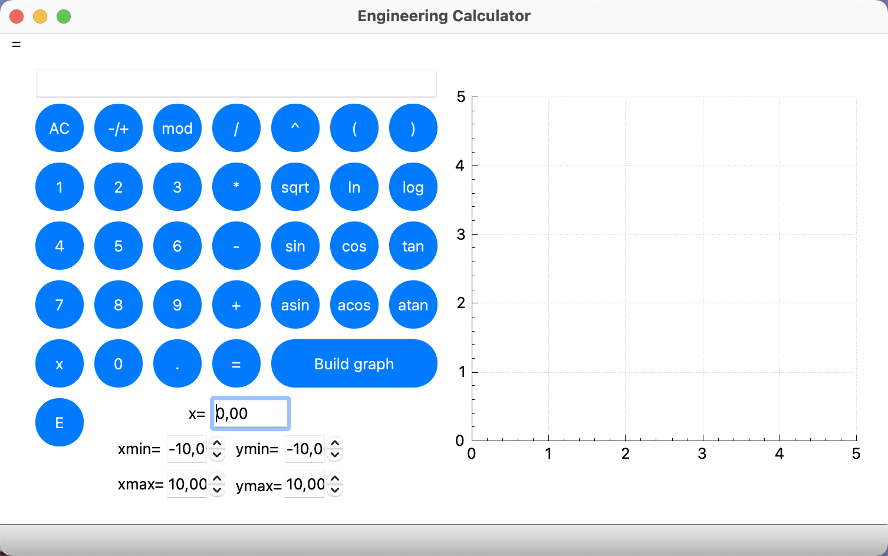
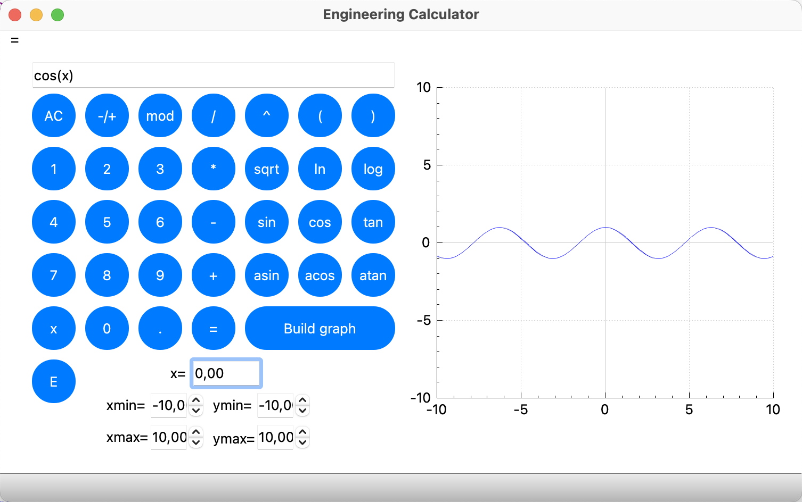
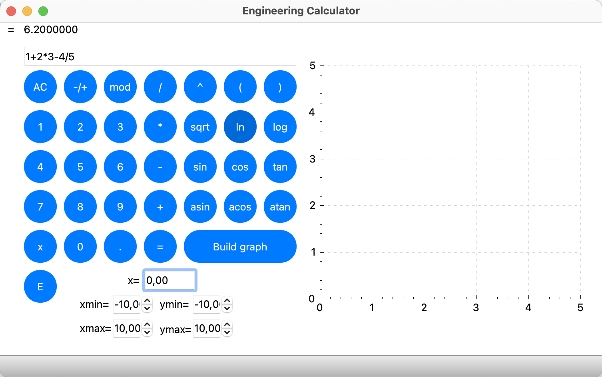
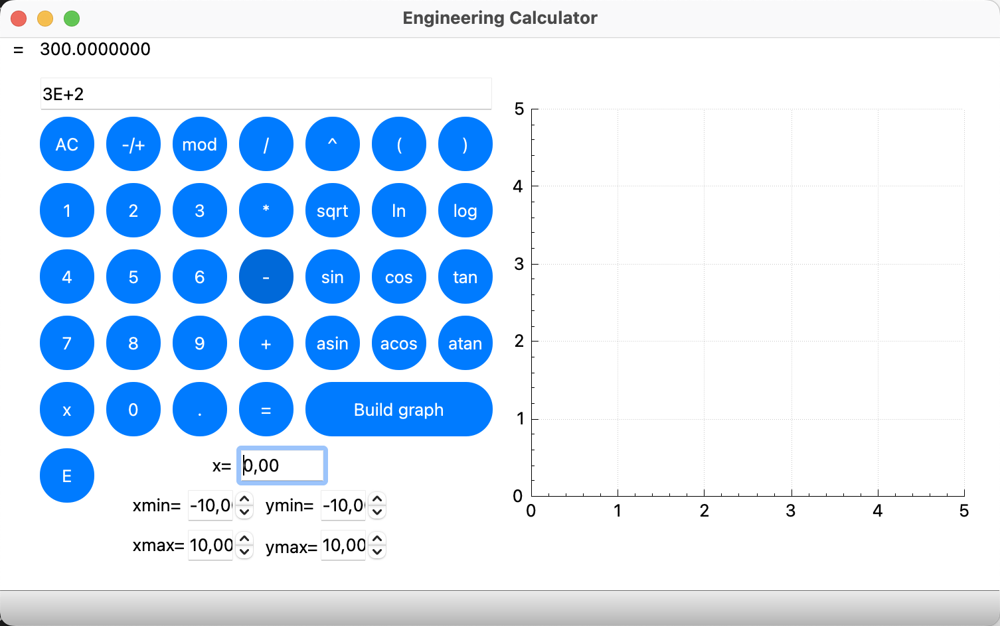

# EngineeringCalculator
## Preview

----------------------

Support graphics

----------------------

Support expressions of any complexity

----------------------

Support Exponential notation

## Supported operators
Brackets, Addition, Subtraction, Multiplication, Division, Power, Modulus, Unary minus

## Supported function
Cosine, Sine, Tangent, Arc Cosine, Arc Sine, Arc Tangent, Square Root, Natural Logarithm, Common Logarith

## About app
Adheres to:
1) MVC(Model View Controller) pattern
2) Google Style C++
3) Standart C++17
4) No leaks (except UI leak by QT)
5) Do not use unnecessary resources

## Installation instruction
App for MacOS (or linux)
Before installation You must have: qmake, g++
1) Go to terminal
2) Paste this text to terminal one by one
> git clone git@github.com:ket03/EngineeringCalculator.git

> cd EngineeringCalculator

> make install

> open build

Completed. Just open app

## Other
Also you can:

Uninstall app
> make uninstall

Сlean up the trash
> make clean

Archive directory
> make dist

Open Readme.md
> make dvi
